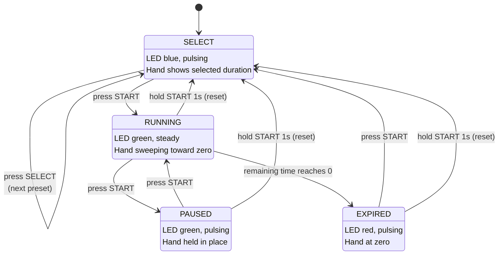
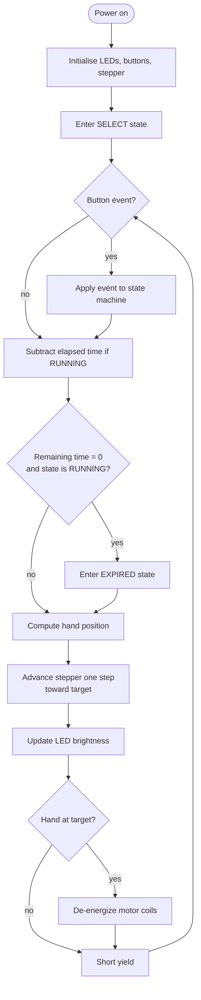

# State Chart and Flowchart

This document satisfies the assignment requirement for "how it operates and how
to control the buttons using a state chart and/or flowchart."

Both diagrams are written in Mermaid, which GitHub renders directly in the
browser. The source is plain text, so it can be diffed and reviewed like code
rather than re-uploaded as an image every time the behavior changes.

---

## Controls

| Control | Action | Result |
|---|---|---|
| Button 1 (SELECT, GPIO5) | Press | Cycle presets: 15 -> 20 -> 25 -> 30 -> 15 min |
| Button 2 (START, GPIO6) | Press | Start the countdown, or pause/resume it |
| Button 2 (START, GPIO6) | Hold 1 second | Reset to preset selection from any state |

| LED appearance | Meaning |
|---|---|
| Blue, pulsing | Choosing a preset |
| Green, steady | Counting down |
| Green, pulsing | Paused |
| Red, pulsing | Time is up |

---

## State Chart

### Notes on the transitions

The reset transition is handled before the per-state logic in `main.py`, which
is why it applies uniformly from every state rather than being duplicated in
each branch.

Pausing stops the countdown but does not move the hand. When the timer resumes,
the clock reference is reset so the paused interval is not subtracted from the
remaining time.

---

## Main Loop Flowchart

### Why the loop is shaped this way

Every module is **non-blocking**. Nothing calls `time.sleep()` during normal
operation. Each pass of the loop reads the millisecond clock, works out what
should be true *right now*, and returns immediately.

If the stepper blocked while stepping, or the LED code slept between brightness
changes, button presses would be dropped and the hand would stutter. Keeping
every subsystem non-blocking is what lets a single core run all three at once
without threads or interrupts.

The motor coils are de-energized as soon as the hand reaches its target. The
gearbox holds position by friction, so there is no reason to keep current
flowing. This is the low-power element of the design.

---

## Dial Convention

The hand reads **absolute minutes**, not percent of the selected preset. Full
scale is the largest preset (30 minutes), so a 15 minute timer starts the hand
at half deflection and sweeps down from there.

The alternative -- every preset starting at full scale -- would mean the same
hand angle represents a different number of minutes depending on which preset
is active, which makes the dial harder to read at a glance.

There is no limit switch on this build, so the firmware cannot sense where the
hand physically is. By convention the hand is assumed to be at the zero mark at
power-on.
